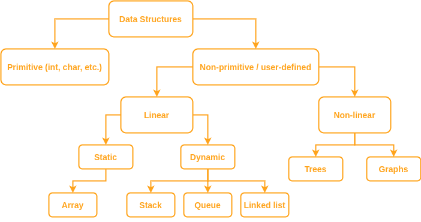

# Упражнение №2
# Сортиране (част 2). Увод в структурите от данни. Реализация на стек с масив. 

## I. Сортиране

**1. Merge sort**

Алгоритъмът се базира на подхода **разделяй и владей**. \
Идея: Разделя масива на две равни части и обединява двата сортирани подмасива. \
База: Масив с един елемент е винаги сортиран.

Merge обединява двата вече сортирани масива в един общ.

Визуализация на merge sort по стъпки.

Ползва допълнителна памет. \
Сложността на рекурсивните алгоритми се определя като се сметне тяхното рекуренто уравнение. \
Рекурентно уравнение на Merge Sort: 
T(n) = 2*T(n/2) + O(n)

**2. Quick sort**

Алгоритъмът се базира на подхода **разделяй и владей**. \
Използва директни сравнения. \
Идея: Избираме водещ елемент (pivot). Поставяме го на правилното му място. Отляво на него подреждаме по-малките от него елементи, а отдясно - по-големите. \
Как избираме пивот? Има различни стратегии: \
1.) Първи елемент \
2.) Медиана \
3.) Последен елемент \
4.) Случаен елемент

Най-добър случай: \
Всеки път масивът се разделя на два (почти) равни подмасива. \
Рекурентно уравнение: T(n) = 2*T(n/2) + O(1)

Най-лош случай: \
Kогато пивотът е най-малкият или най-големият елемент във всяко викане на partition. \
Тогава всяко рекурсивно извикване е върху масив с размер с едно по-малък от предишния. \
Рекурентно уравнение: T(n) = T(n-1) + О(1)

**3. Counting sort**

Не се базира на директни сравнения. \
Идея: Намира броя на срещанията на всеки елемент от зададения интервал и определя позицията му във финалния сортиран масив.

1.) Ефикасен когато интервалът не е значително по-голям от входния масив. \
2.) Пример:
Сортиране на студенти по среден успех - оценка в интервала [2,6].

**4. Анализ**

| \* | Merge sort | Quick sort | Counting sort |
| --- | --- | --- | --- | 
| BC | *O(nlogn)* | *O(nlogn)* | *O(n + k)* |
| AC | *O(nlogn)* | *O(nlogn)* | *O(n + k)* |
| WC | *O(nlogn)* | *O(n^2)* | *O(n + k)* |
| Memory | *O(n)* | *O(1)* | *O(n + k)* |
| Stability | :heavy_check_mark: | ❌ | ❌ | 

Какво прави сложността на Counting Sort толкова добра? 

## II. Структури от данни

**1. Структура от данни**

Начин за организиране на данни с цел ефикасното им  използване.

**2. Защо са ни структури от данни?**

*“Representing information is fundamental to computer science. The primary purpose of most computer programs is not to perform calculations, but to store and retrieve information — usually as fast as possible. For this reason, the study of data structures and the algorithms that manipulate them is at the heart of computer science.”*

**3. Kак избираме структура от данни?**
- Анализираме проблема, за да разберем какви са основните операции, които трябва да поддържаме (такива могат да бъдат добавяне или премахване на елемент, намиране на елемент и др.)
- Оценяваме с какви ресурси разполагаме за всяка от тези операции
- Избираме структура от данни, която отговаря на изискванията

Допълнителни въпроси, които могат да помогнат за избора на структурата са:
- Има ли ред, по който се работи с елементите? 
- Позволява ли се търсене на специфичен елемент?
- В началото ли се добавят всички елементи или може да има други операции междувременно?
- Могат ли да се трият данни?

**📝 4. Пример**

Банкова система предлага следните опции на потребителите си:
1. Отваряне на сметка
2. Закриване на сметка
3. Внасяне на пари по сметка
4. Теглене на пари от сметка

## III. Абстрактни типове данни

**1. ADT - abstract data types**

Това е абстракция, която предоставя интерфейса, към който даден тип се придържа. Свойствата и операциите на абстрактните типове са независими от представянето им в паметта и имплементацията на методите. Този подход се нарича енкапсулация.

| Абстрактен тип данни | Възможности за представяне |
| --- | --- |
| Стек | Масив, свързан списък |
| Опашка | Масив, стек, свързан списък |
| Списък | Масив, свързан списък |

**1. Основни операции** 

Има набор от основни операции, които трябва да бъдат предоставени на потребителя. Реализацията им е скрита от него и той не се интересува от нея. 

Някои основни операции са:
- Добавяне на елемент
- Премахване на елемент
- Търсене на елемент
- Достъп до елемент

Те имат различна сложност според структурата. Затова подбора на подходящ тип/структура при решаването на проблем трябва да е съобразен със спецификите на задачата.

## IV. Класификация на структурите от данни 

- Простите (примитивни) структури от данни са познатите от курса по УП. Там още ги наричахме скаларни типове. Това са int, double, ...

- Съставните структури от данни се разделят на две подкатегории - линейни и нелинейни.

  - Линейни - това са структури, при които елементите се съхваняват в контейнер, който който им позволява да имат наредба. Тоест при тях съществува биекция между множеството на естествените числа и елементите и можем да ги номерираме като 1-ви, 2-ри, …, n-ти, …	
  Линейните СД от своя страна могат да бъдат статични и динамични. Това разграничение показва дали размерът на контейнера може да се променя (дали имаме константна горна граница за броя на елементите, които контейнерът съхранява или тази граница може да се мени).
  - Нелинейни - тези, при които няма линейна наредба на елементите

⚠️ Контейнер наричаме структурата, която сме избрали за съхранението на данните - масив, вектор или др.

## V. Стек

**1. Описание**

Съставна хомогенна линейна структура от данни. \
Представлява крайна редица от еднотипни елементи. \
Подчинява се на принципа LIFO (Last In First Out). \
Достъпът е само до върха на стека.

**2. Основни операции**

1) Добавяне на елемент на върха на стека
2) Премахване на елемент от върха на стека (при предположение, че той не е празен)
3) Достъп до елемента на върха на стека

**3. Приложения**

1) В опцията за “връщане назад” в браузъри
2) В компилатора за проверка за балансираност на скобите, в алгоритми (DFS)
3) За рекурсивни извиквания - пази информация за предишни извиквания на функции

**4. Имплементации**

1) Чрез масив
2) Чрез последователно свързване (свързан списък)

**5. Анализ на сложността** 

| Основна операция | Стек базиран на масив | Стек базиран на свързан списък |
| --- | --- | --- |
| Добавяне на елемент (push) | *O(1)* | *O(1)* |
| Премахване на елемент (pop) | *O(1)* | *O(1)* |
| Достъпване на елемента на върха (peek) | *O(1)* | *O(1)* |
