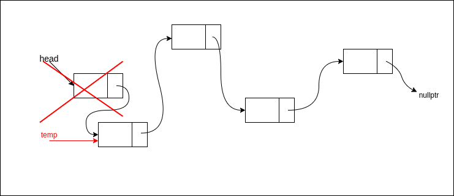

># Упражнение № 3
# Реализация на стек със свързан списък. Задачи върху стек.

## I. Реализация чрез свързан списък

**1. push**

**2. pop**

## II. Задачи 📝 

### **Задача 1.** Обръщане на стек
Да се напише метод за обръщане на стек към реализацията му чрез свързан списък.

    Пример:
    [1, 8, 5, 20, 1] ➡ [1, 20, 5, 8 ,1]

### **Задача 2.** Балансирани скоби
Напишете функция (isBalanced), която по въведен символен низ, състоящ се само от скоби ({,},(,),[,]), проверява дали той е коректен.

    Примери:
    [{[]}()] ➡ true
    [({[()[]]})()] ➡ true
    [{}(]) ➡ false
    [{({}(]))} ➡ false

### **Задача 3.** RPN calculator
Реализирайте калкулатор, който се базира на обратен полски запис (постфиксен запис). Приемаме, че входът е валиден израз.

    Пример:
    Израз в инфиксен запис: ((15 / (7 − (1 + 1))) × 3) − (2 + (1 + 1))
    Вход: 15 7 1 1 + - / 3 * 2 1 1 + + -
    Изход: 5

❓ При вход в инфиксен запис може да се използва следния [алгоритъм](https://en.wikipedia.org/wiki/Shunting-yard_algorithm).  

### **Задача 4.** ✏️ Да се напише функция, която обръща елементите на стек (да се използва std::stack)

### **Задача 5.** ✏️ Ще получите N инструкции, всяка от които ще бъде една от следните: 
1 x - добавя елемент x към стека 
2   - трие елемента на върха на стека 
3   - принтира максималния елемент на стека 
Да се изведе резултата от изпълнението на инструкциите върху празния стек.

    Пример:
    8 (брой операции)
    1 97 (добавя елемент 97)
    2 (трие елемента на върха на стека (97))
    1 20 (добавя елемент 20)
    2 (трие елемента на върха на стека (20))
    1 26 (добавя елемент 26)
    3 (принтира максималния елемент на стека (26))
    1 91 (добавя елемент 91)
    3 (принтира максималния елемент на стека (91))
    ➡ 26 91

### **Задача 6.** ✏️ Да се напише функция, която обръща текст (само реда на думите).

### **Задача 7.** ✏️ Задачата за Ханойските кули.

### **Задача 8.** ✏️ Коледни подаръци
В магазин за играчки решили да раздадат подаръци на децата от детска градина за Коледа. 
За целта подготвили N подаръка (по един за всяко дете) и ги номерирали с числата от 1 до N. 
В магазина имало три улея подредени като на фигурата.  
Първоначално подаръците били наредени в улей 1 в нарастващ ред. 
Децата трябвало да получат подаръците си едно по едно от улей 3, спазвайки определен ред. 
Подаръците могат да се пренареждат с помощта на следните команди:  
1 - Най-десният подарък от улей 1 се премества като най-ляв в улей 2.  
2 - Най-левият подарък от улей 2 се премества като най-десен в улей 3.  
3 - Най-левият подарък в улей 2 се премества като най-десен в улей 1.  
Всеки от трите улея може да събере всички подаръци. 
Напишете програма, която  намира последователност от операции, чрез която подаръците могат да се преместят от улей 1 в улей 3 в предварително зададен ред. 

 

    Вход:
    N - брой на подаръците
    N на брой числа, представляващи реда, който трябва да бъдат подредени подаръците в улей 3
    Изход:
    Поредица от команди, с които да бъде направено преместването.

    Примери: 
    4 
    1 4 2 3 
    ➡ 1 1 1 1 2 3 3 2 1 1 2 2 
    7 
    3 1 2 4 7 5 6 
    ➡ 1 1 1 1 1 2 1 1 2 2 2 3 3 2 1 1 2 2 
