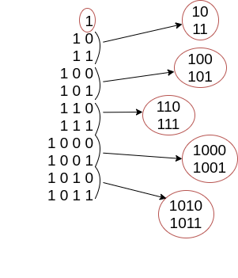
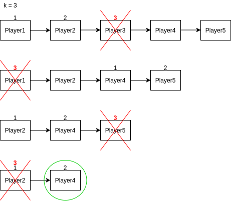
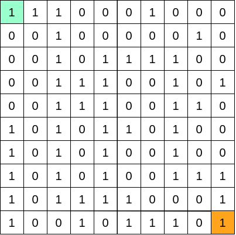

# Упражнение № 4
# Опашкa. Задачи.

## I. Опашка
- линейна динамична структура от данни
- базира се на принципа FIFO (First In First Out)
- отговаря на реалната ни представа за опашка
- началото на опашката наричаме глава (**head**)
  

**Основни операции**
- добавяне на елемент в края на опашката
- триене на елемент от началото на опашката
- достъп до елемента на върха на опашката

**Приложения**
- Представяне на реална опашка
- BFS:  
Основно свойство - елементите се премахват от опашката в ред, определен от отдалечеността им от началния елемент. Това позволява намирането на най-къс път. Процесът по търсене на най-къс път продължава докато:
1. Бъде достигната дестинацията
2. Опашката остане празна - не е намерен път

**Имплементации**
- чрез масив
- чрез свързан списък

**Анализ на сложността**

| Основна операция | Опашка базирана на масив | Опашка базирана на свързан списък |
| --- | --- | --- |
| Добавяне на елемент (enqueue/push) | O(1) | O(1) |
| Премахване на елемент (dequeue/pop) | O(n) | O(1) |
| Достъп до първия елемент (front) | O(1) | O(1) |

## II. Задачи

### **Задача 1.** Двоични числа
Да се напише функция, която генерира всички двоични числа от 1 до n, използвайки опашка.
 
 

    n = 10 ➡ 1 10 11 100 101 110 111 1000 1001 1010

### **Задача 2.** ✏️ Патица, патица, гъска...
Ще направим игра по подобие на популярната детска игра "Патица, патица, гъска...". Нека имаме n играча, подредени в кръг и произволно положително цяло число k, за което е изпълнено, че 0 < k < n.
 
Игра: 
1. Намираме k-тия играч (този, който се намира на k-та позиция спрямо текущата по посока на часовниковата стрелка) 
2. Елиминираме играча на тази позиция
3. Ако играчите са повече от 1, повтаряме стъпките. 
4. Ако играчът е един той печели играта. 
 

Всеки играч се представя с името си. 
Да се напише функция, която връща победителя от играта по подадени играчи и цяло число k.
 

### **Задача 3.** Най-къс път в лабиринт
Дадена е матрица NxM, състояща се от нули и единици. Тя представя лабиринт, в който през полетата, означени с 1 има път, а тези с 0 са стени. Да се напише функция, която намира дължината на най-късия път от подадена начална до подадена крайна позиция в лабиринта. 

### **Задача 4.** Chess Knight Problem 
Да се намери най-късия път от точка А до точка Б на кон на шахматна дъска (или произволно голяма дъска - NxN).

### **Задача 5.** ✏️ Острови
Дадена е двоична матрица NxN, където 0 представя поле Вода, а 1 представя поле Земя. 
Приемаме, че един остров представят съседни полета, които се докосват (включително, ако са съседни по диагонал). Да се намери броя на островите в матрицата.

## III. Циклична опашка
*(незадължителна тема)*

Базира се на принципа FIFO.  
Особеност: последната позиция (клетка) е свързана с първата, образувайки цикъл. От там идва и името на опашката. (Може да се срещне и като ring buffer).  
Примерно приложение: смяна на светлините на светофар.

## IV. Приоритетна опашка
*(незадължителна тема)*
