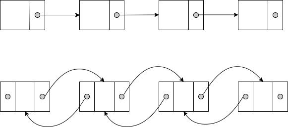
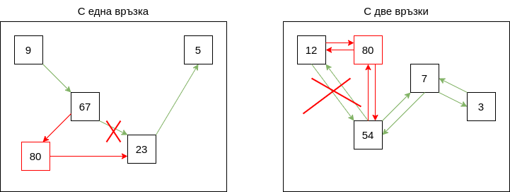

# Упражнение № 5
# Списък

## I. Списък
Списъкът представлява крайна редица от еднотипни (хомогенни) елементи.  

**Основни операции**
- добавяне на елемент в началото/края/на произволна позиция
- премахване на елемент от началото/края/произволна позиция
  

## II. Свързан списък с една връзка

## III. Свързан списък с две връзки

## IV. Анализ на сложността

| Основна операция | Едносвързан списък | Двусвързан списък |
| --- | --- | --- |
| Добавяне на елемент в началото | *O(1)* | *O(1)* |
| Добавяне на елемент в края | *O(1)* | *O(1)* |
| Премахване на елемент от началото | *O(1)* | *O(1)* |
| Премахване на елемент от края | *O(n)* | *O(1)* |
| Достъп до първия елемент | *O(1)* | *O(1)* |
| Достъп до последния елемент | *O(1)* | *O(1)* |

## V. Задачи

### **Задача 1.**
Да се напише функция, която проверява дали в свързан списък съществува цикъл.

### **Задача 2.** 
Да се напише функция, която получава указател към главата на списък и естествено число n и връща стойността на елемента, който се намира на n позиции от опашката на списъка.

    Пример: 
    1 -> 2 -> 3 -> 4 -> 5 -> 6 -> 7 -> 8
    n = 3
    Изход: 5

### **Задача 3.**
Да се напише функция, която премахва дублиращи се елементи от сортиран свързан списък.

### **Задача 4.**
Да се напише функция, която получава указател към главата на свързан списък от цели числа и мести възлите съдържащи четни стойности в края на списъка, но в обратен ред на срещането им.

### **Задача 5.**
Да се напише функция, която получава указател към главата на свързан списък от цели числа и го сортира.
