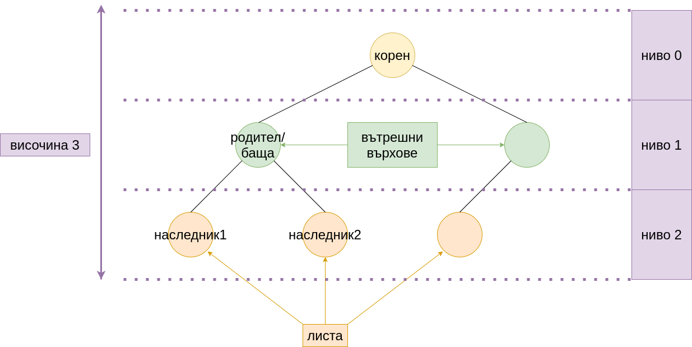

# Упражнение № 7
# Дървета.

## Двоично дърво
Представя се рекурсивно.  
1. Празното дърво е дърво.
2. Непразно дърво има ляво и дясно поддърво.
   

 

**Термини:**  
Листа - върховете с празни ляво и дясно поддърво.  
Вътрешни върхове - върховете, които не са корен или листо.  
Родител - наследник  
Ниво - коренът е на ниво 0 или 1; наследникът на връх на ниво i е на ниво i + 1  
Височина (дълбочина) - разстоянието от корена до листата (максималното ниво).  
 
 

 
 

### Операции

- пряк достъп до корена
- непряк достъп до останалите върхове
- добавяне и премахване на произволен връх (резултатът остава двоично дърво)
- обхождане

### Физическо представяне

- свързано
- последователно
  - чрез 3 масива: за стойността върховете, за левите наследници и за десните наследници
  - списък на бащите 

## Задачи

### **Задача 1.**
Да се напише функция, която намира сумата на елементите на дадено дърво от цели числа.

### **Задача 2.**
Да се напише функция, която проверява дали дадено дърво съдържа елемент X.

### **Задача 3.**
Да се напише функция, която приема двоично дърво и връща броя на елементите му.

### **Задача 4.**
Да се напише функция, която приема двоично дърво и връща най-големият елемент в него. В дървото има поне един елемент.

### **Задача 5.**
Да се напише функция, която намира броя на листата в двоично дърво.

### **Задача 6.**
Да се напише функция, която по подадено двоично дърво и елемент X връща поддървото с корен X, ако такова съществува.

### **Задача 7.**
Да се напише функция, която обхожда дърво ляво-корен-дясно (inorder traversal).

### **Задача 8.**
Да се напише функция, която обхожда дърво корен-ляво-дясно (preorder traversal).

### **Задача 9.**
Да се напише функция, която приема указател към корена на дърво и цяло число N и принтира сумата на елементите, които се намират на ниво N.

### **Задача 10.**
Напишете функция, която приема указател към корена на дърво и цяло число n и принтира елементите, които се намират на ниво n.

### **Задача 11.**
Да се напише функция, която намира височината на двоично дърво.  
а) итеративно  
б) рекурсивно  

