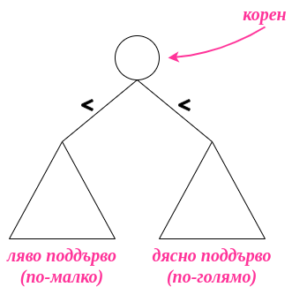
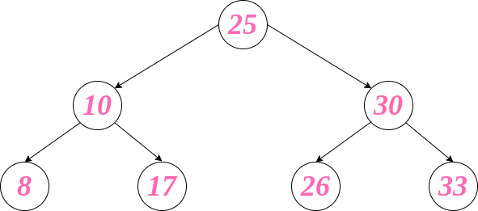
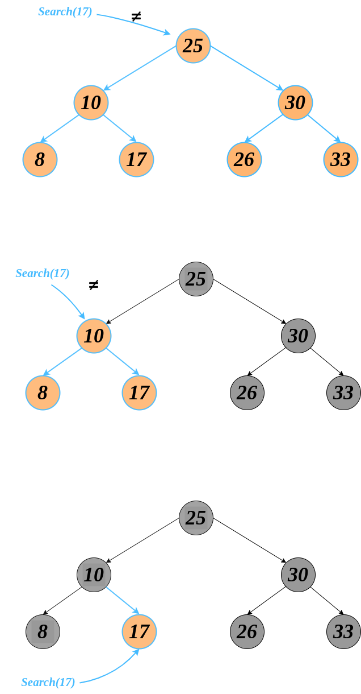
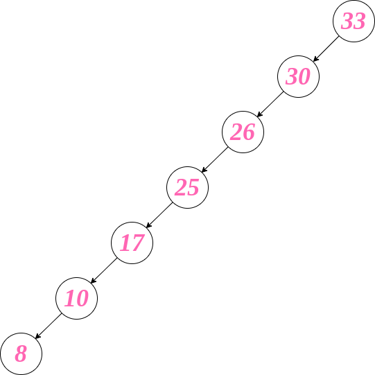
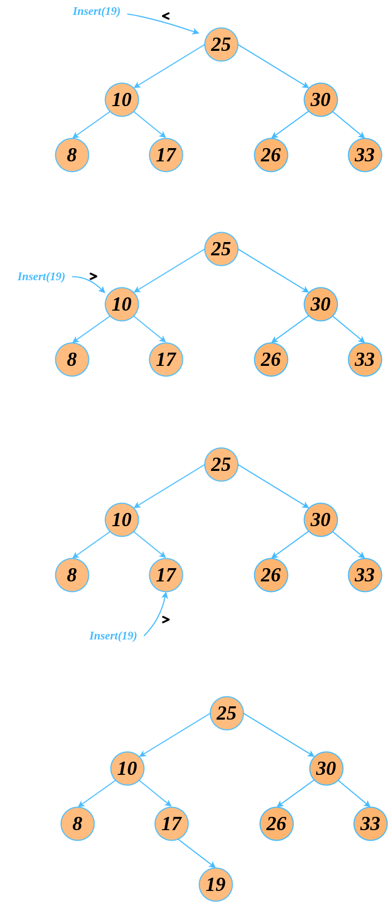
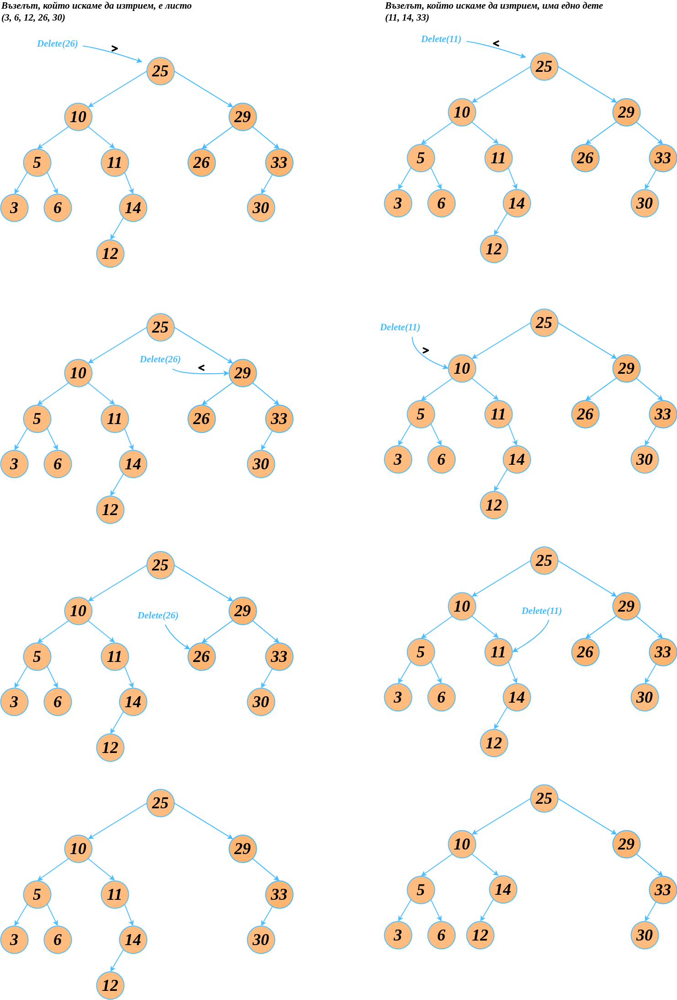

# Упражнение № 8
# Двоично наредено дърво.

## Въведение
Имаме проблем, в който искаме да модифицираме съхранени данни. Коя структура от данни да използваме?  

| операция | масив |
| --- | --- |
| търсене | ***O(n)*** | 
| добавяне | ***O(n)*** |
| триене | ***O(n)*** |

| операция | свързан списък |
| --- | --- |
| търсене | ***O(n)*** |
| добавяне | ***O(n)*** |
| триене | ***O(n)*** | 

** Aко нямаме референция към мястото, на което искаме да извършим добавянето / триенето   
** При наличие на референция операциите за добавяне и триене са с константна сложност

| операция | сортиран масив |
| --- | --- |
| търсене | ***O(logn)*** |
| добавяне | ***O(n)*** |
| триене | ***O(n)*** |

** Добавянето може да бъде осъществено чрез логаритмично намиране на позицията. Самото добавяне ни струва линейно време заради shift-ването на елементите  
** Аналогично за триенето

## Двоично наредено дърво
Оптимизиран вариант на двоично дърво, който ни дава по-добро търсене (от там идва и името Binary Search Tree - BST).   

Двоично наредено дърво - двоично дърво, в което за всеки връх:
- Стойностите на всички върхове в лявото му поддърво са по-малки от стойността на върха
- Стойностите във всички върхове на дясното му поддърво са по-големи от стойността на върха

 
⚠️ За да бъде двоичното дърво наредено, то лявото и дясното му поддърво също трябва да бъдат двоични наредени дървета.
   

**Примери:**

    Валидно дърво

 
 

    Невалидно дърво

## Основни операции в BST

### **1. Търсене**

От къде идва сложността?  
Binary search: n -> n/2 -> n/4 -> ... -> 1  
Това са log(n) стъпки.

Тази идея в двоично дърво:

Кой е най-лошият случай за търсене в двоично наредено дърво?
 
 

⚠️ Ако дървото е балансирано (разликата между височините на лявото и дясното поддърво е максимум 1), то n -> n/2 -> n/4 -> ... -> 1

### **2. Добавяне**

### **3. Триене**

## Сложност на операциите

| операция | двоично наредено дърво (WC) | двоично наредено дърво (AC) |
| --- | --- |  --- |
| търсене | ***O(n)*** | ***Θ(logn)*** |
| добавяне | ***O(n)*** | ***Θ(logn)*** |
| триене | ***O(n)*** | ***Θ(logn)*** |

| операция | балансирано дърво |
| --- | --- |
| търсене | ***O(logn)*** |
| добавяне | ***O(logn)*** |
| триене | ***O(logn)*** |

| операция | масив | свързан списък | сортиран масив | двоично наредено дърво | балансирано дърво |
| --- | --- | --- | --- | --- | --- |
| търсене | ***O(n)*** | ***O(n)*** | ***O(logn)*** |  ***O(n)*** | ***O(logn)*** |
| добавяне | ***O(n)*** | ***O(n)*** | ***O(n)*** |  ***O(n)*** | ***O(logn)*** |
| триене | ***O(n)*** | ***O(n)*** | ***O(n)*** |  ***O(n)*** | ***O(logn)*** |

## Задачи

### **Задача 0**
Какво ще получим при **inorder** обхождане на двоично наредено дърво?

### **Задача 1**
Към реализацията за двоично наредено дърво да се напише контсруктор, който приема масив и по него съставя двоично наредено дърво.

### **Задача 2**
Да се напише функция, която проверява дали дадено двоично дърво е наредено.

### **Задача 3**
Да се намери най-малкия общ предшественик на два възела в двоично наредено дърво.
