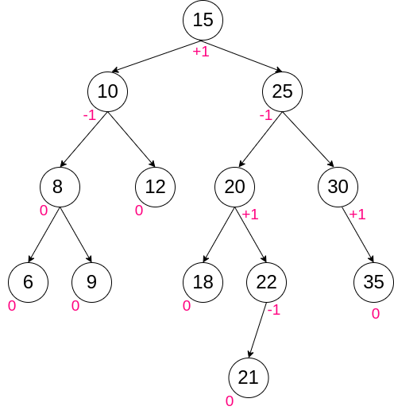
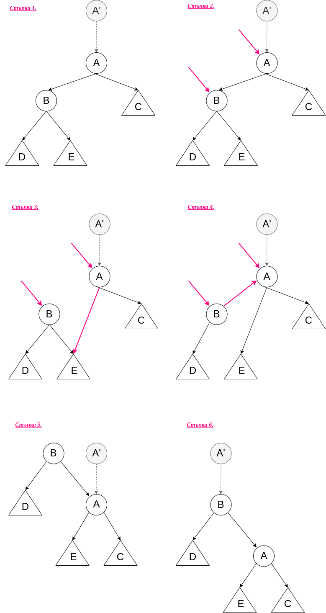
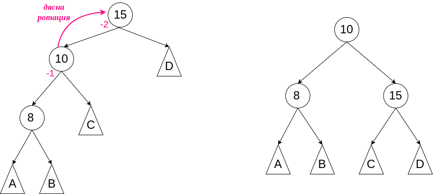
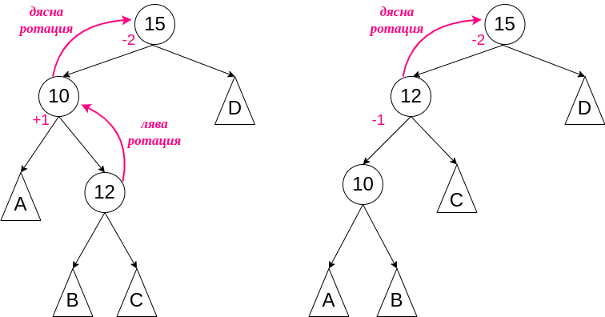
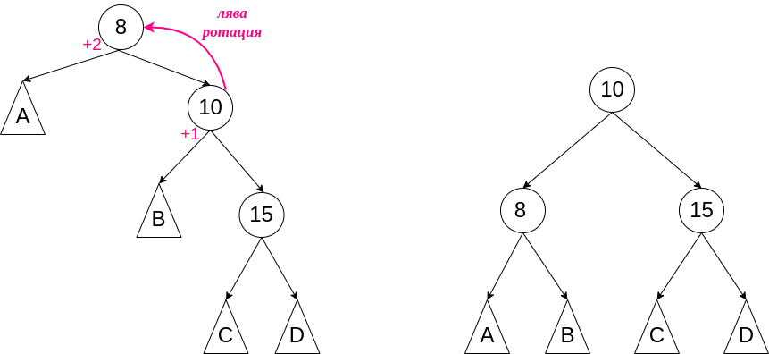
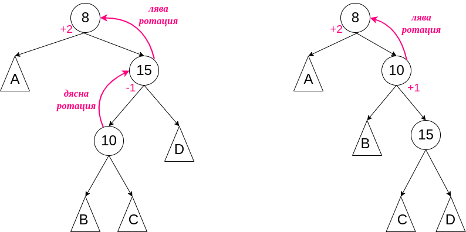

# Упражнение № 9
# Задачи върху двоично наредено дърво

### **Задача 1**
Да се намери k-тия най-малък и k-тия най-голям елемент в двоично наредено дърво.

### **Задача 2**
Да се намери най-близкия общ предшественик на два възела в двоично наредено дърво при допускане, че подадените възли фигурират в дървото.

### **Задача 3**
Да се провери дали два масива представят едно и също двоично наредено дърво без да ги строи.
Приемаме, че възлите се добавят в дървото в реда на срещането им в масива.

    Пример:
    { 15, 25, 20, 22, 30, 18, 10, 8, 9, 12, 6 }
    { 15, 10, 12, 8, 25, 30, 6, 20, 18, 9, 22 }


# Балансирано двоично наредено дърво

**Balanced Binary Search Tree** (BBST) е самобалансиращо се двоично наредено дърво. Такъв тип дървета се пренареждат, така че да поддържат логаритмична височина. С това се осигуряват по-бързи операции за добавяне и триене на елемент.

| операция | двоично наредено дърво | балансирано двоично наредено дърво |
| --- | --- | --- |
| търсене |  ***O(n)*** | ***O(logn)*** |
| добавяне |  ***O(n)*** | ***O(logn)*** |
| триене | ***O(n)*** | ***O(logn)*** |

<br />

Какви самобалансиращи се дървета има?
- AVL tree - разликата във височината на лявото и дясното дете е най-много 1
- B-tree - позволява повече от едно деца
- Red-black tree - всеки възел пази допълнителна информация за *цвета* си
- AA tree - вариация на red-black tree, която позволява добавянето на *червени* върхове само в дясното поддърво
- Weight-balanced trees 
и т.н.

## AVL Tree

1.**Height-balanced tree** <br />
2.Разликата във височината на лявото и дясното поддърво е по-малка или равна на 1. <br />
3.Ако разликата стане по-голяма от 1 се прави ребалансиране.



## Основни операции

### **Кога има нужда да се балансира дървото?** <br />
1.Всеки връх има фактор за балансираност <br />

Нека за репрезентацията на дървото използваме следната структура:
```cpp
template <typename T>
struct Node
{
    T data;
    Node<T>* left;
    Node<T>* right;
};
```

Факторът за балансираност на дървото се смята по формулата: <br />

    BF(node) = height(tree->right) - height(tree->left)

За да бъде дървото AVL tree, трябва да бъде изпълнено, че BF ∈ {-1, 0, +1} за всеки възел от дървото.

### **Търсене**
Тъй като търсенето не модифицира дървото, то няма как да промени свойството му за балансираност.
Операцията по търсене не се различава от операцията по търсене в небалансирано двоично наредено дърво.

### **Ротация**


Защо е валидно? <br />
Инвариантата остава в сила: n.left < n и n < n.right. <br />
** Приемаме, че нямаме повтарящи се стойности

```cpp
Node<T>* rotateRight(Node<T>* root)
{
    Node<T>* temp = root->left
    root->left = temp->right
    temp->right = root;

    return temp
}
```



⚠️ Ротация в поддърво

<b>Основни случаи</b>

    Left left case:



    Left right case:



    Right right case:



    Right left case:



### **Добавяне**

Добавяме само елементи, които не се съдържат в дървото.
След стандартно добавяме проверяваме дали дървото има нужда да се ребалансира.

### **Триене**

Аналогично на премахване на елемент от BST <br />
1.) Намиране на елемента <br />

Премахване на: <br />
1.1.) Листо - директно <br />
1.2.) Връх с единствно ляво или дясно поддърво - пренасочване <br />
1.3.) Връх с ляво и дясно поддърво - заместване на елемента с неговия следващ (successor) <br />
