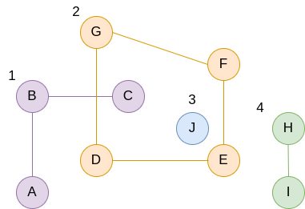
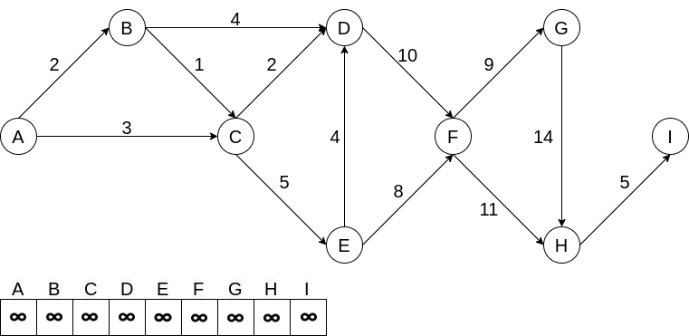

# Упражнение № 12
# Алгоритми върху графи.

## Търсене на броя на свързаните компоненти в граф

## Контролно (2020)
Нека за неориентиран граф G имаме n на брой върхове, зададени чрез техния номер, и m на брой ребра. Освен това е даден масив topValues с n елемента, в който за всеки връх се пази съответна стойност, с която този връх се асоциира, т.е. в topValues[i] се пази стойност, която съответства на i+1-вия връх в графа. Масивът topValues е независим от представянето и дефинирането на графа. Реализирайте функция, която намира сумата от стойностите на онези върхове в G, които се явяват минимални в рамките на компонентата за свързаност, на която принадлежат.  
(Заб: Ако един връх не е свързан с нито един друг връх, то той се брои като самостоятелна компонента на свързаност.)

## Намиране на най-къс път (Dijkstra)
Изискване: **неотрицателни** тегла на ребрата  
Сложност: ***O(E\*logV)***  

**Елементи:**
- Вектор за разстоянията от началния връх до всеки друг (по начало +inf)
- Приоритетна опашка за възлите и разстоянието до тях - дава следващия връх, който трябва да бъде посетен (определя се по най-лекото ребро)
- Опционално: за извличане на пътя - масив, който пази информация за всеки връх от кой връх е бил достигнат (по начало -1)

**Стъпки:**
- Добавяме (s, 0) в приоритетната опашка и въртим цикъл докато тя не е празна
- Итерираме през всички ребра навън спрямо текущото и релаксираме ребрата
- Оптимизация: за намиране на най-къс път между два върха?

## Търсене на цикъл в граф

## Топологическо сортиране
Мотивация: много реални сценарии от ежедневието ни могат да бъдат моделирани с ориентиран граф, така че да изискваме дадени събития да се случат преди други

Алгоритъм, който подрежда върховете на граф, така че в подредбата им за всяко срещане на връх i преди връх j, то не съществува ребро (j, i). С други думи няма ребра, които да сочат "назад" в наредбата на върховете.

Топологическото сортиране не е уникално.

Сложност: ***O(E+V)***  

Изисквания: Графът трябва да е ДАГ (directed acyclic graph). Защо? Какво правим, ако има цикъл?
Алгоритъм:
1. Старитраме от непосетен връх
2. Обхождаме в дълбочина непосетените върхове
3. Добавяме обхождания връх в реда
4. Ако има непосетени върхове се връщаме на т.1
5. Обръщаме масива, в който сме запазили реда (алтернативно добавяме стойностите в обратен ред)

